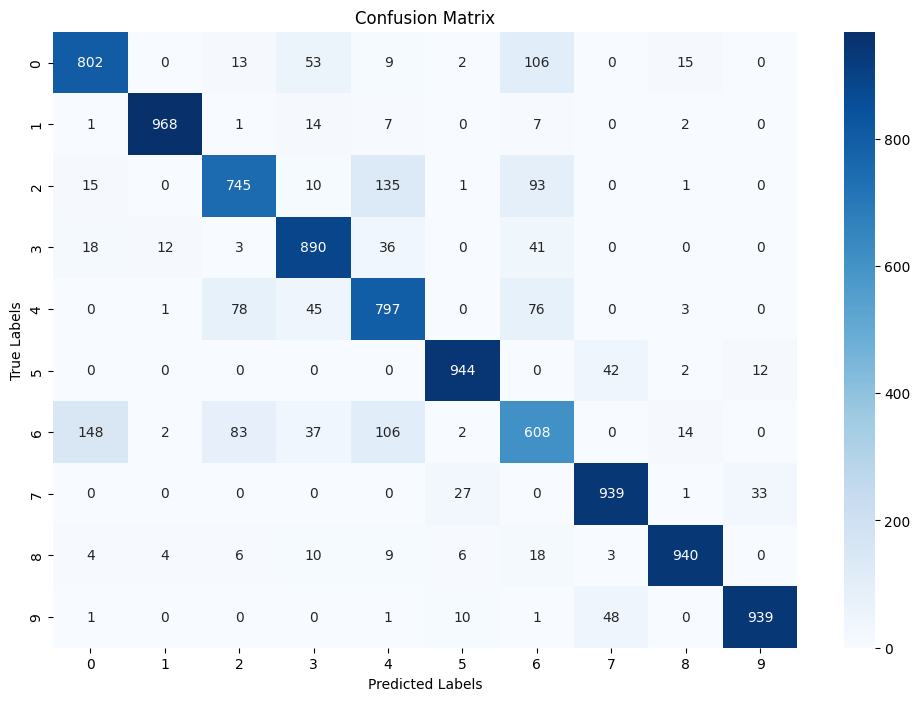
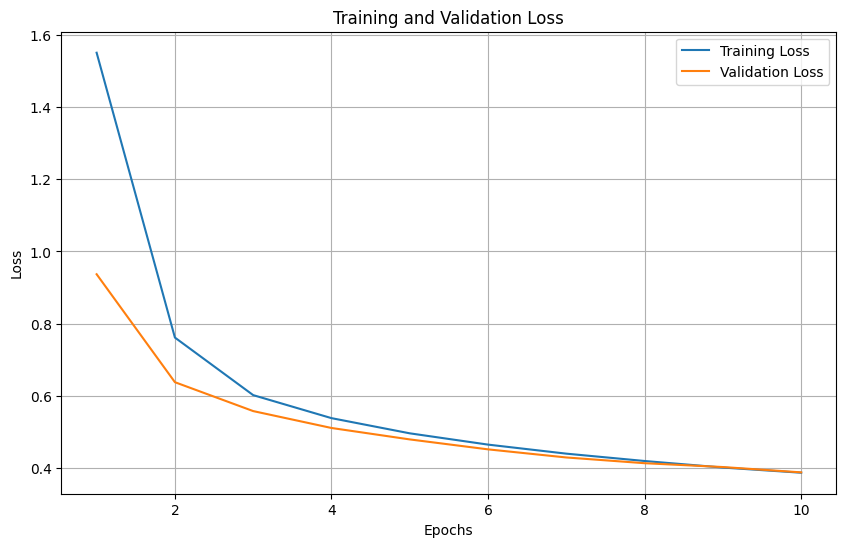

# CNN for Fashion MNIST Classification
*This is a part of Homework assigned by [CCDS](https://ccds.ai/)*

## Overview
This project implements a Convolutional Neural Network (CNN) to classify images from the Fashion MNIST dataset. The dataset contains 10 classes of fashion items.

## Model Architecture
The architecture consists of:
- 3 convolutional layers with ReLU activations.
- Max-pooling layers to downsample features.
- 2 fully connected layers with batch normalization and sigmoid activation.
- Adam optimizer and Xavier initialization.

## Training Results
- **Training Loss:** 0.3860
- **Validation Loss:** 0.3870
- Learning Rate: 0.001
- Batch Size: 1024
- Epochs: 10

## Test Results
| Metric           | Value  |
|-------------------|--------|
| Accuracy          | 86%    |
| Weighted F1-Score | 86%    |

### Class-wise Performance
| Class          | Precision | Recall | F1-Score |
|----------------|-----------|--------|----------|
| T-shirt/top    | 0.81      | 0.80   | 0.81     |
| Trouser        | 0.98      | 0.97   | 0.97     |
| Pullover       | 0.80      | 0.74   | 0.77     |
| Dress          | 0.84      | 0.89   | 0.86     |
| Coat           | 0.72      | 0.80   | 0.76     |
| Sandal         | 0.95      | 0.94   | 0.95     |
| Shirt          | 0.64      | 0.61   | 0.62     |
| Sneaker        | 0.91      | 0.94   | 0.92     |
| Bag            | 0.96      | 0.94   | 0.95     |
| Ankle boot     | 0.95      | 0.94   | 0.95     |

## Observations
1. The model performs well on classes like "Trouser," "Sandal," and "Ankle boot."
2. Performance on "Shirt" is relatively low, possibly due to overlap with other categories.

## Future Improvements
1. **Data Augmentation**: Apply random transformations (e.g., rotations, flipping) to improve generalization.
2. **Hyperparameter Tuning**: Experiment with learning rates, optimizers, and batch sizes.
3. **Architecture Enhancement**: Add dropout layers to reduce overfitting or try deeper networks.

## Confusion Matrix
  

## Training and Validation Loss
  

## Conclusion
The CNN achieves a noteable accuracy of 86%, demonstrating good performance on most classes. Future work will focus on improving the performance of challenging classes like "Shirt."
